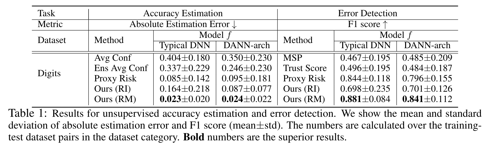

# Detecting Errors and Estimating Accuracy on Unlabeled Data with Self-training Ensembles
This repository is the official implementation of [Detecting Errors and Estimating Accuracy on Unlabeled Data with Self-training Ensembles](https://arxiv.org/abs/2106.15728). 

## Requirements
It is tested under Ubuntu Linux 16.04.1 and Python 3.6 environment, and requries some packages to be installed:
* [PyTorch](https://pytorch.org/)
* [numpy](http://www.numpy.org/)
* [scikit-learn](https://scikit-learn.org/)

To install requirements: `pip install -r requirements.txt`

## Downloading Datasets
* [MNIST-M](http://bit.ly/2fNqL6N): download it from the Google drive. Extract the files and place them in `./dataset/mnist_m/`. 
* [SVHN](http://ufldl.stanford.edu/housenumbers/): need to download Format 2 data (`*.mat`). Place the files in `./dataset/svhn/`.
* [USPS](https://www.kaggle.com/bistaumanga/usps-dataset): download the usps.h5 file. Place the file in `./dataset/usps/`.

## Overview of the Code
* `train_model.py`: train standard models via supervised learning. 
* `train_dann.py`: train domain adaptive (DANN) models. 
* `eval_pipeline.py`: evaluate various methods on all tasks. 

## Running Experiments

### Examples

* To train a standard model via supervised learning, you can use the following command:

`python train_model.py --source-dataset {source dataset} --model-type {model type} --base-dir {directory to save the model}`

`{source dataset}` can be `mnist`, `mnist-m`, `svhn` or `usps`.

`{model type}` can be `typical_dnn` or `dann_arch`. 

* To train a domain adaptive (DANN) model, you can use the following command:

`python train_dann.py --source-dataset {source dataset} --target-dataset {target dataset} --base-dir {directory to save the model} [--test-time]`

`{source dataset}` (or `{target dataset}`) can be `mnist`, `mnist-m`, `svhn` or `usps`.

The argument `--test-time` is to indicate whether to replace the target training dataset with the target test dataset. 

* To evaluate a method on all training-test dataset pairs, you can use the following command:

`python eval_pipeline.py --model-type {model type} --method {method}`

`{model type}` can be `typical_dnn` or `dann_arch`. 

`{method}` can be `conf_avg`, `ensemble_conf_avg`, `conf`, `trust_score`, `proxy_risk`, `our_ri` or `our_rm`.

### Training

You can run the following scrips to pre-train all models needed for the experiments. 
* `run_all_model_training.sh`: train all supervised learning models. 
* `run_all_dann_training.sh`: train all DANN models. 
* `run_all_ensemble_training.sh`: train all ensemble models.

### Evaluation

You can run the following script to get the results reported in the paper.
* `run_all_evaluation.sh`: evaluate all methods on all tasks. 

### Pre-trained Models

We provide pre-trained models produced by our training scripts: `run_all_model_training.sh`, `run_all_dann_training.sh` and `run_all_ensemble_training.sh`. 

You can download the pre-trained models from [Google Drive](https://drive.google.com/drive/folders/1PCUVBW1Wf1JqyN_goC1GiAi-sYFtO26e?usp=sharing). 

## Experimental Results


## Acknowledgements
Part of this code is inspired by [estimating-generalization](https://github.com/chingyaoc/estimating-generalization) and [TrustScore](https://github.com/google/TrustScore). 

## Citation 
Please cite our work if you use the codebase: 
```
@article{chen2021detecting,
  title={Detecting Errors and Estimating Accuracy on Unlabeled Data with Self-training Ensembles},
  author={Chen, Jiefeng and Liu, Frederick and Avci, Besim and Wu, Xi and Liang, Yingyu and Jha, Somesh},
  journal={arXiv preprint arXiv:2106.15728},
  year={2021}
}
```

## License
Please refer to the [LICENSE](LICENSE).